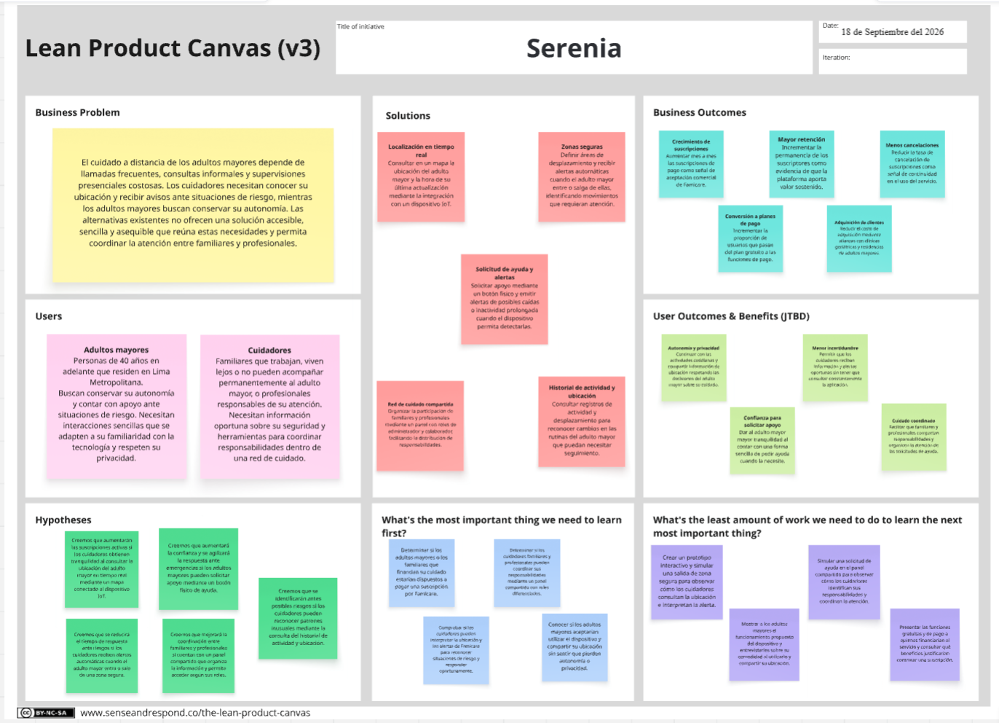

# Capitulo I: Introduction

## 1.1 Startup Profile

### 1.1.1 Descripción de la Startup

Serenia es una startup orientada al desarrollo de soluciones tecnológicas de cuidado y seguridad para adultos mayores, con foco en el bienestar de las familias que enfrentan el reto de acompañar a distancia a sus seres queridos. Nace de la observación de una problemática creciente en Lima Metropolitana y otras ciudades del país: el aumento sostenido de la población adulta mayor y la dificultad de quienes tienen a su cargo su cuidado —familiares que trabajan a tiempo completo o residen en otra ciudad, así como cuidadores profesionales— para garantizar su seguridad diaria.

Nuestro producto, Famicare, es una solución compuesta por un sitio web estático (Landing Page), una aplicación web (Web Application) y un conjunto de servicios RESTful, integrados con dispositivos IoT de localización (wearables tipo pulsera/colgante con GPS, botón de pánico y sensores básicos de actividad). Además, permite a los cuidadores —sean familiares o formales— conocer en tiempo real la ubicación del adulto mayor, definir zonas seguras (geofencing), recibir alertas automáticas ante situaciones de riesgo (salida de zona segura, caídas, inactividad prolongada o activación del botón de pánico) y mantener una comunicación centralizada entre los miembros de la red de cuidado.

### Misión

Brindar tranquilidad a quienes cuidan y mayor autonomía y seguridad a los adultos mayores, a través de tecnología accesible, inclusiva y fácil de usar.

### Visión

Ser la plataforma de referencia en Latinoamérica para el monitoreo y cuidado a distancia de adultos mayores, integrando dispositivos IoT con servicios digitales centrados en las personas.

### 1.1.2. Perfiles de integrantes del equipo

| Foto                                                                                          | Apellido y Nombre                                  | Descripción|
|-----------------------------------------------------------------------------------------------|----------------------------------------------------|------|
|                                | *Arroyo Gonzales, Emily Juliette - U202311469*     | Soy estudiante de la carrera de Ingeniería de Software, tengo 20 años, tengo experiencia en lenguajes como C++,Python, MongoDB,etc. En trabajos grupales me gusta aportar ideas que contribuyan a mi grupo y avanzar según lo asignado.
|  | *Yauri Barrios, Antony David - U202214499*         | Soy estudiante de la carrera de Ingeniería de Software, tengo 22 años. Trabajo con stacks MERN & PERN, además de lenguajes como C++, C# y Java.
|                                 | *Estupiñan Olortegui, Juan Sebastian - U202223405* | Estudiante de Ingeniería de Software, con habilidades en C++, Java, Angular, HTML y Docker, también desarrollo diseño para aplicaciones y plataformas de web design. Soy demasiado dispuesto a trabajar en equipo y coordinar las tareas entre todos.
|                              | *Atoche Gonzales, Nicolas Fernando u20241d317*     | Actualmente estoy en el sexto ciclo de la carrera de ingeniería de software. Poseo un conocimiento básico/intermedio en programación con C++, Lua, Luau, Python y Java. Además, cuento con conocimientos básicos en el desarrollo de videojuegos. Suelo orientarme por el conocimiento y el pensamiento lógico, con lo cual suelo buscar la solución más óptima y ágil dentro de un problema a través de pasos sencillos y definidos que construyan una base sólida donde pueda desarrollar respuestas claras y efectivas.
|                                                         | *Nombre, apellido y código*                        | Descripción

## 1.2. Solution Profile

### 1.2.1 Antecedentes y problemática

**What (¿Cuál es el problema?)**

La dificultad de monitorear en tiempo real la ubicación y el estado de seguridad de un adulto mayor cuando este se encuentra fuera del alcance visual directo de quien lo cuida.

**When (¿Cuándo sucede el problema?)**

Durante los desplazamientos cotidianos del adulto mayor (salidas al parque, mercado, citas médicas) y en los periodos del día en que los cuidadores están en el trabajo o fuera del hogar.

**Where (¿Dónde surge el problema?)**

Principalmente en zonas urbanas de Lima Metropolitana y otras ciudades del Perú, en hogares donde el adulto mayor vive solo o pasa largos periodos sin supervisión.

**Who (¿A quiénes les afecta?)**

Adultos mayores (40 años a más) que viven solos o con supervisión limitada, y las personas que tienen a su cargo su cuidado: cuidadores familiares (hijos, cónyuges u otros parientes que trabajan o residen lejos) y cuidadores formales (enfermeras a domicilio, personal de residencias).

**Why (¿Por qué sucede el problema?)**

El envejecimiento poblacional en el Perú avanza de forma acelerada; según el INEI, la población adulta mayor supera ya el 13% del total nacional y continúa en crecimiento. A ello se suman condiciones asociadas a la edad (deterioro cognitivo leve, riesgo de caídas, desorientación) que incrementan la ansiedad de los cuidadores y el riesgo real de incidentes no detectados a tiempo.

**How (¿Cómo sucede el problema?)**

A través de una plataforma que combina un dispositivo IoT portátil (con GPS y botón de pánico) con una aplicación web que centraliza la información, define zonas seguras y notifica automáticamente a la red de cuidado ante eventos de riesgo.

**How Much (¿Qué impacto tiene?)**

Se estima que una proporción significativa de familias limeñas con adultos mayores a cargo incurre en gastos recurrentes en cuidadores presenciales o pierde horas productivas de trabajo por la necesidad de supervisión constante; asimismo, servicios de telemonitoreo similares en el mercado internacional tienen un costo mensual que puede resultar inaccesible para el segmento socioeconómico medio en Perú, lo que evidencia una oportunidad de negocio con un modelo de precios adaptado a la realidad local.

**Problemática**

Actualmente, quienes tienen a su cargo el cuidado de un adulto mayor —ya sea un familiar o un cuidador profesional— carecen de una herramienta accesible, confiable y fácil de usar que les permita saber en todo momento dónde se encuentra el adulto mayor y si se encuentra a salvo, sin recurrir a soluciones costosas, complejas o pensadas para otros contextos (como el monitoreo de flotas o de menores de edad). Esto genera ansiedad constante en los cuidadores, sobrecarga en quien ejerce el rol de cuidado principal, y expone a los adultos mayores a riesgos que podrían mitigarse con una respuesta más oportuna (caídas sin asistencia inmediata, extravíos, desorientación en la vía pública, entre otros).

### 1.2.2 Lean UX Process
#### *1.2.2.1 Lean UX Problem Statements*

Actualmente, la atención remota y el monitoreo de seguridad para adultos mayores dependen principalmente de que los cuidadores recurran a llamadas telefónicas frecuentes, consultas informales o costosas supervisiones presenciales para verificar que la persona a su cargo se encuentre segura.

Lo que los productos y servicios existentes no ofrecen es una solución accesible, fácil de usar y asequible que permita a los cuidadores (ya sean familiares o profesionales) conocer la ubicación en tiempo real y el estado de seguridad de la persona mayor a su cargo, así como recibir alertas inmediatas ante cualquier situación inusual.

Serenia cubrirá esta necesidad mediante Famicare, integrada con dispositivos de localización IoT de bajo costo; esto permitirá a los cuidadores definir zonas seguras, recibir alertas de riesgo en tiempo real y coordinar la atención de manera colaborativa dentro de una red de cuidados compartida.

Nos centraremos inicialmente en los cuidadores (familiares o profesionales) responsables de la seguridad de adultos mayores (de 40 años en adelante) que residen en zonas urbanas de Lima.

Sabremos que hemos tenido éxito cuando observemos que los cuidadores consultan diariamente la ubicación y el estado de las zonas seguras de la persona mayor a través de la plataforma, y ​​responden a las alertas de riesgo pocos minutos después de recibirlas.

#### *1.2.2.2 Lean UX Assumption*

##### Business Assumptions

1. Creemos que existe una oportunidad de mercado entre adultos mayores y cuidadores en el Perú que necesitan herramientas para apoyar la seguridad, la autonomía y el acompañamiento a distancia.
2. Creemos que los adultos mayores o los familiares responsables de financiar su cuidado estarían dispuestos a pagar una suscripción accesible por un servicio que les aporte tranquilidad y facilite la atención de situaciones de riesgo.
3. Creemos que un modelo freemium, con funciones básicas gratuitas y planes de pago que incluyan múltiples dispositivos e historial extendido, permitiría atraer usuarios y generar ingresos recurrentes.
4. Creemos que establecer alianzas con farmacias, clínicas geriátricas y residencias de adultos mayores facilitaría dar a conocer Famicare y llegar a sus segmentos objetivo.
5. Creemos que Serenia podrá integrar dispositivos IoT existentes y compatibles con Famicare, reduciendo la inversión necesaria para desarrollar hardware propio.

##### Business Outcome Assumptions

1. Creemos que un crecimiento mensual sostenido de las suscripciones de pago aportará evidencia de la aceptación comercial de Famicare.
2. Creemos que una mayor retención de suscriptores y una menor tasa de cancelación indicarán que Famicare ofrece valor de manera sostenida.
3. Creemos que un incremento en la proporción de usuarios que pasan del plan gratuito a un plan de pago respaldará la estrategia de monetización propuesta.
4. Creemos que una reducción del costo de adquisición de clientes mediante alianzas contribuirá a la sostenibilidad del negocio.

##### User Assumptions

1. Creemos que los adultos mayores que desean conservar su autonomía y contar con apoyo ante situaciones de riesgo constituyen uno de los segmentos de usuarios de Famicare.
2. Creemos que los cuidadores familiares que trabajan, viven lejos o no pueden acompañar permanentemente al adulto mayor utilizarán Famicare para mantenerse informados y coordinar su cuidado.
3. Creemos que los cuidadores profesionales utilizarán Famicare como apoyo para supervisar a los adultos mayores a su cargo y compartir información relevante con la red de cuidado.
4. Creemos que los adultos mayores tendrán distintos niveles de familiaridad con la tecnología y autonomía, por lo que necesitarán formas de interacción sencillas y accesibles.
5. Creemos que una misma red de cuidado podrá incluir a varios cuidadores con diferentes responsabilidades y necesidades de acceso a la información.

##### User Outcome and Benefit Assumptions

1. Creemos que los adultos mayores desean continuar con sus actividades cotidianas con mayor autonomía y confianza en que podrán solicitar apoyo cuando lo necesiten.
2. Creemos que los adultos mayores desean compartir información sobre su ubicación y actividad de una manera que respete su privacidad y sus decisiones sobre el cuidado que reciben.
3. Creemos que los cuidadores desean reducir la incertidumbre asociada al cuidado a distancia mediante información oportuna sobre el adulto mayor.
4. Creemos que los cuidadores desean enterarse de posibles situaciones de riesgo sin tener que consultar constantemente la aplicación.
5. Creemos que los adultos mayores y sus cuidadores se beneficiarán de una mejor coordinación de las responsabilidades y de la atención de solicitudes de ayuda.

##### Feature Assumptions

1. Creemos que un mapa con la ubicación del adulto mayor y la hora de su última actualización ayudará a los cuidadores a consultar su localización y reconocer qué tan reciente es la información disponible.
2. Creemos que la configuración de zonas seguras y las alertas de entrada o salida ayudarán a los cuidadores a identificar desplazamientos que requieran atención.
3. Creemos que un botón de ayuda en el dispositivo IoT ofrecerá al adulto mayor una forma sencilla de enviar una solicitud de apoyo a su red de cuidado.
4. Creemos que las alertas ante posibles caídas o inactividad prolongada, cuando el dispositivo compatible permita detectarlas, facilitarán que los cuidadores identifiquen situaciones que necesiten verificación.
5. Creemos que un panel de gestión de la red de cuidado, con permisos diferenciados para administradores y colaboradores, facilitará la distribución de responsabilidades entre cuidadores.
6. Creemos que un historial de ubicación y actividad permitirá a los cuidadores reconocer cambios en las rutinas del adulto mayor que ameriten seguimiento.
7. Creemos que una interfaz accesible, con textos legibles, navegación sencilla y controles claros, facilitará el uso de Famicare por parte de adultos mayores y cuidadores.

#### *1.2.2.3 Lean UX Hypothesis Statements*

- **Hipótesis 1:** Creemos que lograremos aumentar el número de suscripciones activas de cuidadores que atienden a una persona mayor y obtienen tranquilidad mediante la visualización en tiempo real de la ubicación de dicha persona, gracias a un mapa de localización integrado en el dispositivo IoT.
- **Hipótesis 2:** Creemos que lograremos reducir el tiempo de respuesta ante situaciones de riesgo si los cuidadores que supervisan a una persona mayor reciben un aviso inmediato cuando esta abandona una zona segura, mediante una función de geocerca que envía alertas automáticas al entrar o salir de dicha zona.
- **Hipótesis 3:** Creemos que lograremos una mayor confianza por parte del usuario y una respuesta más rápida ante emergencias si las personas mayores pueden solicitar ayuda al instante  mediante un botón de pánico físico integrado en el dispositivo equipable IoT.
- **Hipótesis 4:** Creemos que lograremos una mejor coordinación y una responsabilidad compartida entre los cuidadores si los familiares y profesionales de una misma red de cuidados disponen de una visión organizada y común de las necesidades y el estado de la persona mayor, a través de un panel de gestión de la red con acceso basado en roles.
- **Hipótesis 5:** Creemos que lograremos detectar antes los riesgos para la salud o la seguridad si los cuidadores pueden identificar patrones inusuales antes de que se conviertan en emergencias, gracias a un panel de control que muestra el historial de actividad y ubicación.

#### *1.2.2.4 Lean UX Canvas*

**Enlace al Lean UX Canvas:** [*Ver en Miro*](https://miro.com/app/board/uXjVHlTKtVk=/?share_link_id=862851859420)

## 1.3 Segmento Objetivo

#### 1.3.1 Segmento 1: Adultos mayores autónomos

  - **Descripción:** Personas de 40 años a más, que mantienen cierto nivel de independencia (pueden salir solos a realizar actividades cotidianas como ir al parque, mercado o citas médicas), pero que presentan riesgos asociados a la edad (caídas, desorientación, deterioro cognitivo leve).

  - **Características demográficas:** Residentes en zonas urbanas de Lima Metropolitana; con o sin experiencia previa en el uso de tecnología; valoran su independencia y pueden mostrar resistencia inicial a sentirse "vigilados".

  - **Necesidad principal:** Mantener su autonomía y libertad de movimiento, contando con un mecanismo simple para pedir ayuda en caso de emergencia.

#### Segmento 2: Cuidadores (familiares y formales)

  - **Descripción:** Personas responsables del bienestar y la seguridad de uno o varios adultos mayores. Este segmento agrupa dos perfiles con la misma necesidad central —saber que el adulto mayor está bien y poder actuar rápido si algo ocurre— aunque con matices distintos en su relación con él:

    - **Cuidadores familiares:** hijos/as, cónyuges u otros parientes (típicamente entre 20 y 60 años) que no pueden estar físicamente presentes de forma constante debido a compromisos laborales o distancia geográfica, y que suelen asumir el rol de administrador de la cuenta del adulto mayor.

    - **Cuidadores formales:** enfermeras a domicilio, acompañantes terapéuticos o personal de residencias geriátricas, que tienen a su cargo el cuidado directo de uno o varios adultos mayores de forma remunerada, y que suelen requerir acceso como colaboradores dentro de la red de cuidado.

  - **Características demográficas:** Nivel socioeconómico B y C (cuidadores familiares) o personal técnico/profesional de salud (cuidadores formales); residentes en zonas urbanas de Lima Metropolitana u otras ciudades del Perú; con acceso a smartphone e internet.

  - **Necesidad principal:** Conocer en tiempo real la ubicación y estado de seguridad del adulto mayor, coordinar responsabilidades con otros cuidadores de la misma red, y recibir alertas oportunas ante situaciones de riesgo, sin depender de llamadas o visitas constantes.
