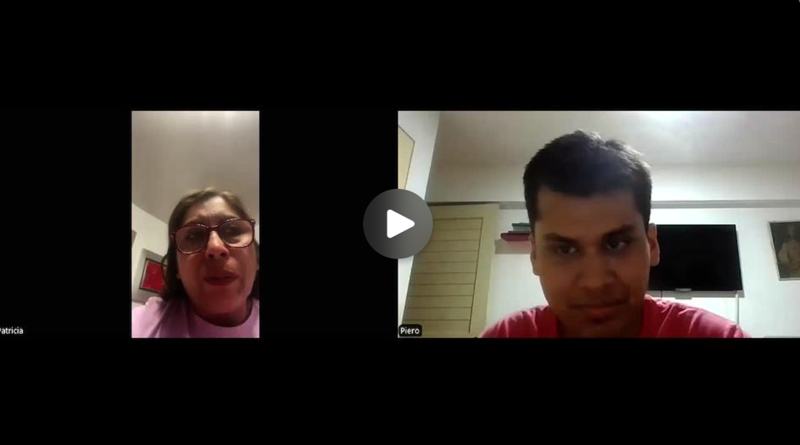
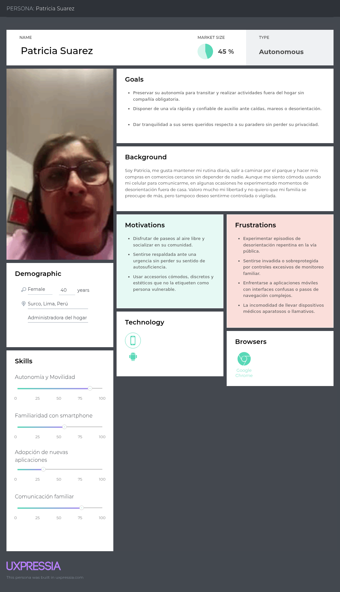
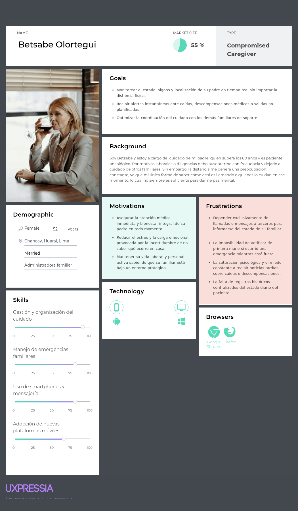
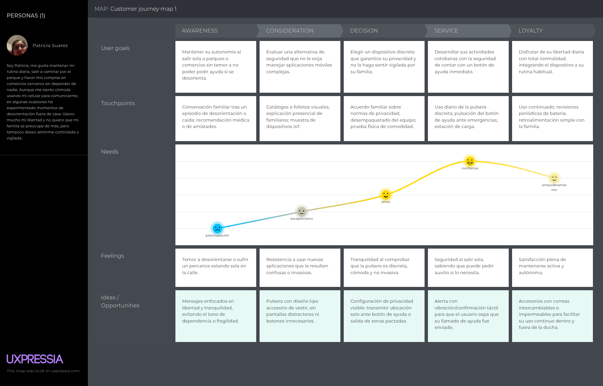
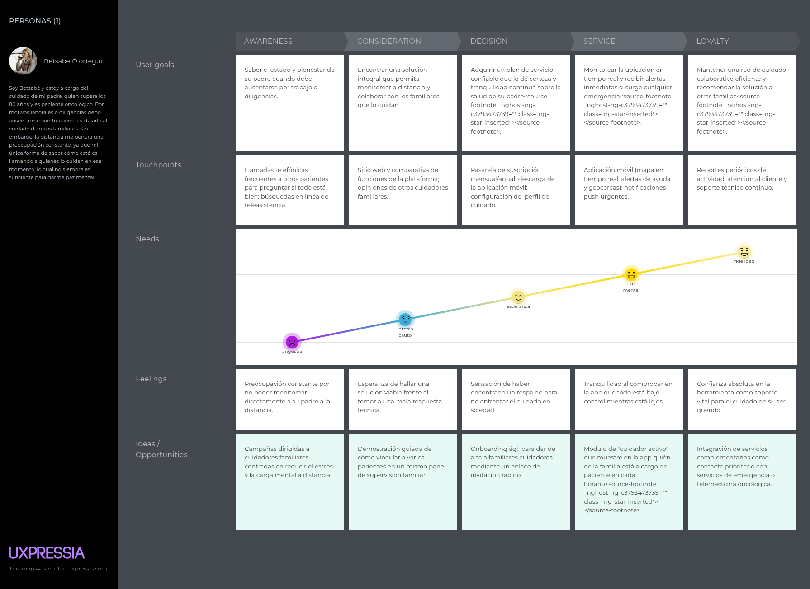
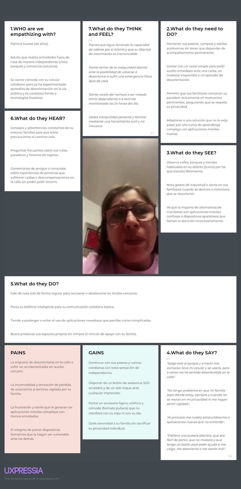
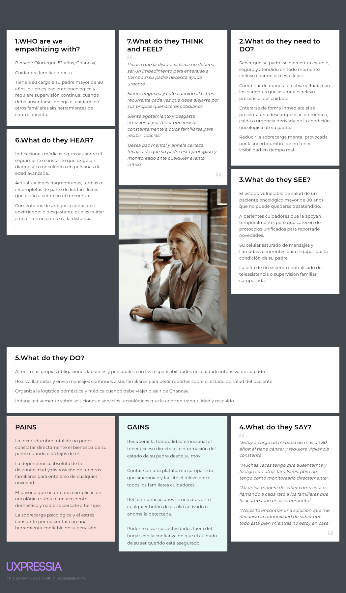
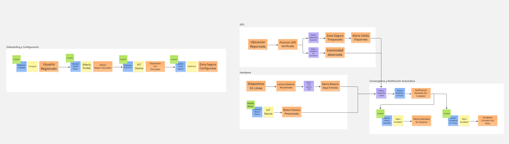

# Capitulo II: Requirements Elicitation & Analysis
## 2.1 Competidores

### 2.1.1 Analisis Competitivo

<table style="border-collapse: collapse; width: 100%;">
<tr>
<th colspan="6" style="vertical-align: top;">Competitive Analysis Landscape</th>
</tr>

<tr>
<td colspan="2" style="vertical-align: top;">¿Por qué llevar a cabo este análisis?</td>
<td colspan="4" style="vertical-align: top;">Determinar cómo puede Famicare diferenciarse de las soluciones existentes de monitoreo para adultos mayores mediante una plataforma web accesible económicamente, con foco en la coordinación entre cuidadores familiares y formales, y en una experiencia inclusiva tanto para el adulto mayor como para quien lo cuida.</td>
</tr>

<tr>
<td colspan="2" rowspan="2" style="vertical-align: top;">Startup y Competidores</td>
<td style="vertical-align: top;">Famicare</td>
<td style="vertical-align: top;">Life360</td>
<td style="vertical-align: top;">AngelSense</td>
<td style="vertical-align: top;">GCare</td>
</tr>

<tr>
<td style="vertical-align: top;"></td>
<td style="vertical-align: top;"></td>
<td style="vertical-align: top;"></td>
<td style="vertical-align: top;"></td>
</tr>

<tr>
<td rowspan="2" style="vertical-align: top;">Perfil</td>
<td style="vertical-align: top;">Overview</td>
<td style="vertical-align: top;">Plataforma web (Landing Page + Web Application + RESTful API) integrada con dispositivo IoT de bajo costo, orientada a la coordinación entre cuidadores y la seguridad del adulto mayor.</td>
<td style="vertical-align: top;">App de localización familiar de propósito general, con un tracker adicional (Jiobit) orientado a personas con riesgo de extravío.</td>
<td style="vertical-align: top;">Wearable + app especializados en personas con riesgo de deambulación (demencia, autismo).</td>
<td style="vertical-align: top;">Reloj inteligente + app, modelo HaaS, con enfoque AgeTech/GovTech y expansión regional activa.</td>
</tr>

<tr>
<td style="vertical-align: top;">Ventaja competitiva ¿Qué valor ofrece?</td>
<td style="vertical-align: top;">Accesibilidad económica, experiencia 100% web responsive, coordinación multi-cuidador (familiares y formales) y enfoque inclusivo pensado para el contexto peruano.</td>
<td style="vertical-align: top;">Amplia base de usuarios, marca reconocida, funciones adicionales de seguridad vial.</td>
<td style="vertical-align: top;">Alta precisión de geolocalización y reducción de falsas alarmas mediante aprendizaje de rutinas.</td>
<td style="vertical-align: top;">Modelo de negocio integral (hardware + servicio + soporte 24/7), alianzas institucionales (B2B/B2G), presencia regional creciente.</td>
</tr>

<tr>
<td rowspan="2" style="vertical-align: top;">Perfil de Marketing</td>
<td style="vertical-align: top;">Mercado objetivo</td>
<td style="vertical-align: top;">Cuidadores (familiares y formales) peruanos NSE B/C, a cargo de adultos mayores autónomos o con riesgo leve/moderado.</td>
<td style="vertical-align: top;">Familias en general (incluye niños, adolescentes y adultos mayores) a nivel global.</td>
<td style="vertical-align: top;">Familias y cuidadores de personas con condiciones cognitivas específicas, mercado principalmente EE. UU.</td>
<td style="vertical-align: top;">Familias, cajas de compensación, clínicas y municipios en Chile, con expansión a Perú y Paraguay.</td>
</tr>

<tr>
<td style="vertical-align: top;">Estrategias de marketing</td>
<td style="vertical-align: top;">Landing Page, validación mediante entrevistas y pilotos con cuidadores del segmento objetivo.</td>
<td style="vertical-align: top;">Marketing digital masivo, app stores, marca consolidada.</td>
<td style="vertical-align: top;">Marketing especializado dirigido a asociaciones de Alzheimer/autismo y comunidades de cuidadores.</td>
<td style="vertical-align: top;">Alianzas institucionales (municipios, cajas de compensación), programas de aceleración (CORFO, YLAI, LATAM Scale Up).</td>
</tr>

<tr>
<td rowspan="3" style="vertical-align: top;">Perfil de Producto</td>
<td style="vertical-align: top;">Productos & Servicios</td>
<td style="vertical-align: top;">Mapa en tiempo real, geofencing, botón de pánico, panel de red de cuidado con roles (administrador/colaborador), historial de actividad.</td>
<td style="vertical-align: top;">Ubicación en tiempo real, Place Alerts, reportes de manejo, detección de choques (Life360); tracking cross-señal y Care Team (Jiobit).</td>
<td style="vertical-align: top;">Geolocalización de alta precisión, aprendizaje de rutinas, alertas de cambios inesperados.</td>
<td style="vertical-align: top;">Reloj con botón SOS, detector de caídas, monitoreo de signos vitales, GPS en tiempo real, plataforma web/app.</td>
</tr>

<tr>
<td style="vertical-align: top;">Precios & Costos</td>
<td style="vertical-align: top;">Modelo a validar; se proyecta suscripción mensual accesible orientada al segmento B/C peruano.</td>
<td style="vertical-align: top;">Planes freemium y de pago por suscripción mensual/anual.</td>
<td style="vertical-align: top;">Suscripción mensual + costo del dispositivo.</td>
<td style="vertical-align: top;">Modelo HaaS: costo del dispositivo + plan de 12 meses.</td>
</tr>

<tr>
<td style="vertical-align: top;">Canales de distribución</td>
<td style="vertical-align: top;">Web responsive (Landing Page + Web Application), sin necesidad de app nativa.</td>
<td style="vertical-align: top;">App móvil (iOS/Android)</td>
<td style="vertical-align: top;">App móvil + dispositivo físico.</td>
<td style="vertical-align: top;">App móvil/web + dispositivo físico, canal directo y a través de instituciones aliadas.</td>
</tr>

<tr>
<td rowspan="4" style="vertical-align: top;">Análisis SWOT</td>
<td style="vertical-align: top;">Fortalezas</td>
<td style="vertical-align: top;">Enfoque 100% web (menor barrera de entrada, no requiere descarga de app nativa); precio accesible; coordinación multi-cuidador.</td>
<td style="vertical-align: top;">Marca reconocida, gran base instalada, ecosistema de dispositivos (Jiobit).</td>
<td style="vertical-align: top;">Alta especialización y precisión para casos de deambulación</td>
<td style="vertical-align: top;">Modelo de negocio validado con canales institucionales; ya cuenta con planes de entrada a Perú.</td>
</tr>

<tr>
<td style="vertical-align: top;">Debilidades</td>
<td style="vertical-align: top;">Producto nuevo, sin cartera de clientes ni reconocimiento de marca.</td>
<td style="vertical-align: top;">No está especializado en adultos mayores; puede resultar invasivo o complejo para un adulto mayor.</td>
<td style="vertical-align: top;">Dispositivo y suscripción con costos más altos; foco en mercado EE. UU., sin presencia regional.</td>
<td style="vertical-align: top;">Depende de la venta de un dispositivo propietario (hardware); ticket de entrada más alto para el usuario final.</td>
</tr>

<tr>
<td style="vertical-align: top;">Oportunidades</td>
<td style="vertical-align: top;">Mercado peruano de AgeTech aún poco atendido; posibilidad de alianzas con clínicas geriátricas, residencias o servicios de cuidadores formales.</td>
<td style="vertical-align: top;">Podría extender su enfoque hacia adultos mayores en mercados emergentes.</td>
<td style="vertical-align: top;">Podría expandirse a Latinoamérica</td>
<td style="vertical-align: top;">Expansión activa a Perú y Paraguay.</td>
</tr>

<tr>
<td style="vertical-align: top;">Amenazas</td>
<td style="vertical-align: top;">Entrada de competidores con mayor respaldo financiero (como GCare) al mercado peruano.</td>
<td style="vertical-align: top;">Percepción de "vigilancia" excesiva puede generar rechazo en adultos mayores.</td>
<td style="vertical-align: top;">Alto costo puede limitar adopción en mercados con menor poder adquisitivo.</td>
<td style="vertical-align: top;">Depende de la cadena de suministro de hardware y de acuerdos institucionales que toman tiempo en concretarse.</td>
</tr>

</table>

### 2.1.2 Estrategia y tácticas frente a competidores

##### Estrategias:

- Posicionar a FamiCare como una solución accesible y fácil de utilizar para adultos mayores y cuidadores, considerando sus distintos niveles de familiaridad con la tecnología.
- Diferenciar la propuesta mediante la integración de ubicación, alertas de riesgo y una red de cuidado compartida que facilite la coordinación entre familiares y cuidadores profesionales.
- Ofrecer un modelo freemium que permita conocer las funciones básicas antes de contratar planes de pago con múltiples dispositivos e historial extendido.
- Promover la confianza en el acompañamiento a distancia, destacando el respeto por la privacidad y la autonomía del adulto mayor como parte de la propuesta de valor.

##### Tácticas:

- Incorporar tutoriales breves y guías visuales que expliquen cómo consultar la ubicación, configurar zonas seguras y utilizar el botón de ayuda.
- Buscar alianzas con farmacias, clínicas geriátricas y residencias de adultos mayores para presentar FamiCare a sus potenciales usuarios y generar confianza.
- Realizar demostraciones y publicar contenido en redes sociales sobre las alertas y la coordinación del cuidado, mostrando situaciones cotidianas de adultos mayores y cuidadores.
- Mostrar en la landing page las funciones de cada plan y ejemplos de uso, explicando cómo FamiCare puede complementar las llamadas y el acompañamiento presencial.
- Explicar claramente qué información se comparte y quién puede consultarla, para que los adultos mayores y sus cuidadores comprendan el funcionamiento de la red de cuidado.

## 2.2 Entrevistas

### 2.2.1 Diseño de entrevistas

Se diseñaron dos guías de entrevista, una por cada segmento objetivo identificado en el Capítulo I. Las preguntas buscan recoger tanto información demográfica como información conductual y actitudinal (personalidad, frustraciones, canales digitales, dispositivos de preferencia) necesaria para construir los User Personas.

**Segmento 1: Adultos mayores autónomos**

1. Cuéntame sobre tu día típico: ¿a qué lugares sueles salir solo/a?
2. ¿Usas algún celular o dispositivo cuando sales de casa? ¿Cómo te sientes usándolo?
3. ¿Alguna vez te has sentido perdido/a, desorientado/a o has tenido una caída estando fuera de casa?
4. ¿Cómo te sientes con la idea de que quien te cuida (familiar o cuidador) pueda saber dónde estás en todo momento?
5. ¿Qué tan fácil o difícil te resulta usar aplicaciones nuevas en el celular?
6. Si tuvieras un botón para pedir ayuda en caso de emergencia, ¿en qué situaciones lo usarías?
7. ¿Qué te haría sentir que una tecnología como esta te ayuda, en lugar de hacerte sentir vigilado/a?
8. ¿Qué tipo de dispositivo preferirías llevar contigo (reloj, colgante, pulsera)? ¿Por qué?

**Segmento 2: Cuidadores (familiares y formales)**

1. Cuéntame un poco sobre ti: ¿a qué te dedicas? ¿Cuál es tu relación con el adulto mayor que cuidas (familiar directo, cónyuge, cuidador contratado, personal de una residencia, etc.)?
2. ¿Cuántos adultos mayores tienes actualmente a tu cuidado y con qué frecuencia interactúas con ellos (todo el día, algunas horas, a distancia)?
3. ¿Qué haces actualmente para saber si el adulto mayor a tu cargo está bien cuando no estás presente?
4. ¿Alguna vez has sentido preocupación o ansiedad por no saber dónde está o cómo está el adulto mayor? Cuéntame de esa experiencia.
5. ¿Ha ocurrido alguna situación de riesgo (caída, extravío, desorientación) con el adulto mayor a tu cargo? ¿Cómo la manejaste y cómo te comunicaste con otros involucrados en su cuidado (otros familiares, colegas, la familia contratante)?
6. ¿Usas alguna aplicación o dispositivo para monitorear al adulto mayor actualmente? ¿Cuál y qué opinas de ella?
7. ¿Qué tan cómodo te sientes usando aplicaciones móviles o web en tu día a día?
8. ¿Hay otras personas que también deberían poder ver esta información (otros familiares, otro cuidador de turno, la familia contratante)? ¿Cómo coordinas hoy con ellas?
9. (Si es cuidador familiar) ¿Cuánto estarías dispuesto/a a pagar mensualmente por una solución que te dé tranquilidad sobre la seguridad de tu familiar?
10. (Si es cuidador formal) ¿Qué información te gustaría poder compartir fácilmente con la familia del adulto mayor (ubicación, actividad, incidentes)? ¿Qué te preocuparía sobre compartir acceso con varias personas a la vez?
11. ¿Qué es lo que más valorarías de una aplicación de este tipo (facilidad de uso, rapidez de alertas, precio, privacidad)?

### 2.2.2 Registro de entrevistas

##### Entrevistas a Adultos mayores autónomos (Segmento 1):

##### Entrevista 1:
|              Atributo               | Detalle |    
|:-----------------------------------:|:--------------------------------------------------------------------------------------------------------------------------------------------------------------------------------------------------------------------------------------------------------------------------------------------------------------------------------------------------------------------------------------------------------------------------------------------------------------------------------------------------------------------------------------------------------------------------------------------------------------------------------------------------------------------------------------------------------------------------------------------------------------------------------------------------------------------------------------------------------------------------------------------------------------------------------------------------------------------------------------------------------------------------------------------------------------------------------------------------------------------------------------------------------------------------------------------------------------------------------------------------------------------------------------------------------------------------------------------------------------------------------------------------------------------------------|
|               Nombre                | Patricia Suarez |
|                Edad                 | 40   |
|              Distrito               | Surco   |
|         Fecha de entrevista         | 17 de septiembre del 2026 |
|               Timing                | 00:00 - 4:14  |
|        Enlace a la grabación        | [https://upcedupe-my.sharepoint.com/personal/u202213484_upc_edu_pe/_layouts/15/stream.aspx?id=%2Fpersonal%2Fu202213484_upc_edu_pe%2FDocuments%2Fvideo1968336476.mp4&nav=eyJyZWZlcnJhbEluZm8iOnsicmVmZXJyYWxBcHAiOiJPbmVEcml2ZUZvckJ1c2luZXNzIiwicmVmZXJyYWxBcHBQbGF0Zm9ybSI6IldlYiIsInJlZmVycmFsTW9kZSI6InZpZXciLCJyZWZlcnJhbFZpZXciOiJNeUZpbGVzTGlua0NvcHkifX0&ga=1&referrer=StreamWebApp.Web&referrerScenario=AddressBarCopied.view.66cc9be6-dd92-4fc6-b42f-f64974693606](https://upcedupe-my.sharepoint.com/personal/u202213484_upc_edu_pe/_layouts/15/stream.aspx?id=%2Fpersonal%2Fu202213484_upc_edu_pe%2FDocuments%2Fvideo1968336476.mp4&nav=eyJyZWZlcnJhbEluZm8iOnsicmVmZXJyYWxBcHAiOiJPbmVEcml2ZUZvckJ1c2luZXNzIiwicmVmZXJyYWxBcHBQbGF0Zm9ybSI6IldlYiIsInJlZmVycmFsTW9kZSI6InZpZXciLCJyZWZlcnJhbFZpZXciOiJNeUZpbGVzTGlua0NvcHkifX0&ga=1&referrer=StreamWebApp.Web&referrerScenario=AddressBarCopied.view.66cc9be6-dd92-4fc6-b42f-f64974693606) |
| Captura de pantalla de la grabación |   |
|               Resumen               | Patricia sale sola a parques y comercios cercanos, lleva su celular y se siente cómoda usándolo, aunque alguna vez se sintió desorientada fuera de casa. Acepta que su familia conozca su ubicación siempre que respete su privacidad; le cuesta al principio usar aplicaciones nuevas y usaría un botón de ayuda en caídas, malestar o si se pierde. Preferiría una pulsera discreta, fácil de llevar y sin molestar, que le dé seguridad sin hacerla sentir vigilada. |

##### Entrevistas a Ciudadores (Segmento 2):

##### Entrevista 1:
|              Atributo               | Detalle |    
|:-----------------------------------:|:--------------------------------------------------------------------------------------------------------------------------------------------------------------------------------------------------------------------------------------------------------------------------------------------------------------------------------------------------------------------------------------------------------------------------------------------------------------------------------------------------------------------------------------------------------------------------------------------------------------------------------------------------------------------------------------------------------------------------------------------------------------------------------------------------------------------------------------------------------------------------------------------------------------------------------------------------------------------------------------------------------------------------------------------------------------------------------------------------------------------------------------------------------------------------------------------------------------------------------------------------------------------------------------------------------------------------------------------------------------------------------------------------------------------------------|
|               Nombre                | Betsabé Olortegui |
|                Edad                 | 52   |
|              Distrito               | Chancay   |
|         Fecha de entrevista         | 15 de septiembre del 2026 |
|               Timing                | 00:00 - 14:37  |
|        Enlace a la grabación        | [https://upcedupe-my.sharepoint.com/personal/u202223405_upc_edu_pe/_layouts/15/stream.aspx?id=%2Fpersonal%2Fu202223405_upc_edu_pe%2FDocuments%2Fvideo1109525562%2Emp4&nav=eyJyZWZlcnJhbEluZm8iOnsicmVmZXJyYWxBcHAiOiJPbmVEcml2ZUZvckJ1c2luZXNzIiwicmVmZXJyYWxBcHBQbGF0Zm9ybSI6IldlYiIsInJlZmVycmFsTW9kZSI6InZpZXciLCJyZWZlcnJhbFZpZXciOiJNeUZpbGVzTGlua0NvcHkifX0&nav=eyJyZWZlcnJhbEluZm8iOnsicmVmZXJyYWxBcHAiOiJPbmVEcml2ZUZvckJ1c2luZXNzIiwicmVmZXJyYWxBcHBQbGF0Zm9ybSI6IldlYiIsInJlZmVycmFsTW9kZSI6InZpZXciLCJyZWZlcnJhbFZpZXciOiJNeUZpbGVzTGlua0NvcHkifX0&ga=1](https://upcedupe-my.sharepoint.com/personal/u202223405_upc_edu_pe/_layouts/15/stream.aspx?id=%2Fpersonal%2Fu202223405_upc_edu_pe%2FDocuments%2Fvideo1109525562%2Emp4&nav=eyJyZWZlcnJhbEluZm8iOnsicmVmZXJyYWxBcHAiOiJPbmVEcml2ZUZvckJ1c2luZXNzIiwicmVmZXJyYWxBcHBQbGF0Zm9ybSI6IldlYiIsInJlZmVycmFsTW9kZSI6InZpZXciLCJyZWZlcnJhbFZpZXciOiJNeUZpbGVzTGlua0NvcHkifX0&nav=eyJyZWZlcnJhbEluZm8iOnsicmVmZXJyYWxBcHAiOiJPbmVEcml2ZUZvckJ1c2luZXNzIiwicmVmZXJyYWxBcHBQbGF0Zm9ybSI6IldlYiIsInJlZmVycmFsTW9kZSI6InZpZXciLCJyZWZlcnJhbFZpZXciOiJNeUZpbGVzTGlua0NvcHkifX0&ga=1) |
| Captura de pantalla de la grabación |   |
|               Resumen               | Betsabé está al cuidado de su padre mayor a 80 años, quien es paciente oncológico, por lo que debe estar bajo cuidado constante. Asegura que muchas veces al estar alejada, lo deja al cuidado de otros familiares, pero no tiene forma de monitorearlo más que contactar a los familiares que lo cuidan en el momento, y por eso busca una solución para que pueda darle tranquilidad de que todo está bien. |

##### Entrevista 2:
|              Atributo               | Detalle |    
|:-----------------------------------:|:--------------------------------------------------------------------------------------------------------------------------------------------------------------------------------------------------------------------------------------------------------------------------------------------------------------------------------------------------------------------------------------------------------------------------------------------------------------------------------------------------------------------------------------------------------------------------------------------------------------------------------------------------------------------------------------------------------------------------------------------------------------------------------------------------------------------------------------------------------------------------------------------------------------------------------------------------------------------------------------------------------------------------------------------------------------------------------------------------------------------------------------------------------------------------------------------------------------------------------------------------------------------------------------------------------------------------------------------------------------------------------------------------------------------------------|
|               Nombre                | Keyla Suarez |
|                Edad                 | 27   |
|              Distrito               | Ate   |
|         Fecha de entrevista         | 18 de septiembre del 2026 |
|               Timing                | 00:00 - 3:18  |
|        Enlace a la grabación        | [https://upcedupe-my.sharepoint.com/personal/u202214499_upc_edu_pe/_layouts/15/stream.aspx?id=%2Fpersonal%2Fu202214499_upc_edu_pe%2FDocuments%2FEntrevista.mp4&nav=eyJyZWZlcnJhbEluZm8iOnsicmVmZXJyYWxBcHAiOiJPbmVEcml2ZUZvckJ1c2luZXNzIiwicmVmZXJyYWxBcHBQbGF0Zm9ybSI6IldlYiIsInJlZmVycmFsTW9kZSI6InZpZXciLCJyZWZlcnJhbFZpZXciOiJNeUZpbGVzTGlua0NvcHkifX0&ga=1&referrer=StreamWebApp.Web&referrerScenario=AddressBarCopied.view.40f6c618-3e5a-493d-a15a-f83eeeb4d4fe](https://upcedupe-my.sharepoint.com/personal/u202214499_upc_edu_pe/_layouts/15/stream.aspx?id=%2Fpersonal%2Fu202214499_upc_edu_pe%2FDocuments%2FEntrevista.mp4&nav=eyJyZWZlcnJhbEluZm8iOnsicmVmZXJyYWxBcHAiOiJPbmVEcml2ZUZvckJ1c2luZXNzIiwicmVmZXJyYWxBcHBQbGF0Zm9ybSI6IldlYiIsInJlZmVycmFsTW9kZSI6InZpZXciLCJyZWZlcnJhbFZpZXciOiJNeUZpbGVzTGlua0NvcHkifX0&ga=1&referrer=StreamWebApp.Web&referrerScenario=AddressBarCopied.view.40f6c618-3e5a-493d-a15a-f83eeeb4d4fe) |
| Captura de pantalla de la grabación |   |
|               Resumen               | Keyal Suárez, de 27 años, trabaja en una empresa de cosméticos y dedica algunas horas al día al cuidado de su abuelo. Ella se encarga de su cuidado junto con otros familiares. Uno de sus principales problemas ocurre cuando no puede estar presente, ya que su abuelo debe tomar medicamentos, pero no recuerda correctamente los horarios, por lo que puede tomarlos a destiempo o incluso olvidarse de tomarlos. Keyal no conoce actualmente ninguna aplicación de monitoreo o recordatorio para adultos mayores. Estaría dispuesta a pagar por una aplicación siempre que cumpla completamente con sus expectativas y realmente facilite el cuidado de su abuelo. Su principal necesidad es que la aplicación sea intuitiva, sencilla y fácil de utilizar para su abuelo, especialmente considerando sus dificultades para recordar los horarios de sus medicamentos.

### 2.2.3 Analisis de entrevistas

## 2.2.3. Análisis de entrevistas

#### Segmento 1 - Adultos mayores:

**Total de entrevistas registradas:** 1  
**Entrevistada:** Patricia Suarez  
**Edad registrada:** 40 años  
**Distrito:** Surco

**Observación:** La edad consignada no coincide con el segmento definido para FamiCare, compuesto por personas de 65 años en adelante. Es necesario verificar este dato antes de incluir la entrevista como evidencia de dicho segmento. Los siguientes hallazgos corresponden únicamente al caso de Patricia.

#### Características objetivas

- **Desplazamiento independiente:** Patricia señala que sale sola a parques y comercios cercanos.
- **Uso del celular durante sus salidas:** Indica que lleva consigo su teléfono cuando sale de casa.
- **Experiencia de desorientación:** Menciona que alguna vez se sintió desorientada fuera de su hogar.

#### Características subjetivas

- **Comodidad con el celular:** Manifiesta sentirse cómoda utilizando su teléfono.
- **Dificultad inicial con aplicaciones nuevas:** Señala que al principio le cuesta utilizar aplicaciones que no conoce.
- **Aceptación condicionada de la localización:** Aceptaría que su familia conozca su ubicación siempre que se respete su privacidad.
- **Interés en un botón de ayuda:** Indica que lo utilizaría ante una caída, malestar o una situación en la que se encuentre perdida.
- **Preferencia por un dispositivo discreto:** Preferiría una pulsera cómoda, fácil de llevar y que no le genere molestias.
- **Valoración de la autonomía:** Busca sentirse segura sin percibir que está siendo vigilada.
---

#### Segmento 2 - Cuidadores:

**Total de entrevistados:** 2  
**Edades:** 52 y 27 años  
**Distritos:** Chancay y Ate

#### Características objetivas

- **Cuidado de un familiar adulto mayor:** 100% (2/2) participan en el cuidado de un familiar: Betsabé cuida a su padre y Keyla a su abuelo.
- **Participación de otros familiares:** 100% (2/2) cuentan con familiares que también intervienen en el cuidado del adulto mayor.
- **Ausencia durante parte del cuidado:** 100% (2/2) describen situaciones en las que no pueden estar presentes junto al adulto mayor.
- **Seguimiento mediante contacto con familiares:** 50% (1/2: Betsabé) señala que, cuando está lejos, depende de comunicarse con quienes cuidan a su padre para conocer su estado.
- **Dificultades con los horarios de medicamentos:** 50% (1/2: Keyla) indica que su abuelo puede olvidar sus medicamentos o tomarlos fuera del horario correspondiente.
- **Desconocimiento de aplicaciones de apoyo:** 50% (1/2: Keyla) manifiesta que no conoce aplicaciones de monitoreo o recordatorios para adultos mayores.

#### Características subjetivas

- **Búsqueda de tranquilidad durante la ausencia:** 50% (1/2: Betsabé) expresa interés en una solución que le permita saber que su padre se encuentra bien cuando no está presente.
- **Preferencia por una aplicación sencilla:** 50% (1/2: Keyla) considera importante que la aplicación sea intuitiva y fácil de utilizar para su abuelo.
- **Disposición de pago condicionada al valor:** 50% (1/2: Keyla) estaría dispuesta a pagar si la aplicación cumple sus expectativas y facilita realmente el cuidado.
- **Interés en apoyar el cumplimiento de horarios:** 50% (1/2: Keyla) identifica como una necesidad ayudar a su abuelo a recordar cuándo debe tomar sus medicamentos.

## 2.3 Needfinding

### 2.3.1 User Personas

User Persona Segmento 1 — Adultos mayores:

User Persona Segmento 2 — Cuidadores:

### 2.3.2 User Task Matrix

Las siguientes matrices clasifica las tareas que desempeñan ambos perfiles en la solución Famicare, valorando su frecuencia temporal y su nivel de criticidad para la seguridad del usuario.

Segmento 1: Adultos Mayores Autónomos – Patricia Suarez

| Tarea (Task) | Frecuencia | Importancia | Contexto y Justificación |
| :--- | :---: | :---: | :--- |
| Portar pulsera discreta y ligera en salidas cotidianas | Diaria | Alta | Prefiere un accesorio fácil de llevar que no incomode en parques o comercios. |
| Activar botón de auxilio SOS ante emergencias | Raras veces / Emergencia | Alta | Para usarlo ante caídas repentinas, malestares físicos o desorientación fuera de casa. |
| Recargar batería del dispositivo | Diaria / Interdiaria | Alta | Requiere un proceso simple que no demande configuraciones complejas. |
| Gestionar privacidad de la ubicación | Ocasional / Inicial | Alta | Permite que su familia conozca su ubicación siempre que no invada su intimidad. |
| Interactuar con aplicaciones móviles nuevas | Rara vez / Inicial | Baja | Manifiesta dificultad para familiarizarse con nuevas aplicaciones, prefiriendo la pulsera. |
| Consultar mapa de ubicación en tiempo real | Nunca | Baja | Ella no consulta la app para ubicarse; la utilidad radica en ser localizada si lo necesita. |

Segmento 2: Cuidadores – Betsabé Olortegui

| Tarea (Task) | Frecuencia | Importancia | Contexto y Justificación |
| :--- | :---: | :---: | :--- |
| Monitorear el estado del adulto mayor a la distancia | Varias veces al día | Alta | Brinda tranquilidad continua al estar lejos de su padre con condición oncológica. |
| Coordinar con otros familiares el cuidado compartido | Diaria / Frecuente | Alta | Facilita la comunicación y el relevo con parientes que asisten al paciente en el momento. |
| Recibir y responder a alertas críticas de emergencia | Ocasional (según evento) | Alta | Permite enterarse al instante de cualquier caída o complicación médica grave. |
| Configurar y delimitar geocercas de seguridad | Mensual | Alta | Asegura que el paciente se mantenga en entornos seguros de cuidado o atención médica. |
| Supervisar la recarga y conectividad del dispositivo | Diaria | Alta | Garantiza que el equipo esté operativo sin interrupciones. |
| Gestionar la suscripción y membresía del servicio | Mensual | Media | Mantiene activa la plataforma de monitoreo familiar. |

### 2.3.3 User Journey Mapping

Segmento 1: Adultos mayores autónomos

Segmento 2: Cuidadores

### 2.3.4 Empathy Mapping

Segmento 1: Adultos mayores autónomos

Segmento 2: Cuidadores

## 2.4 Big Picture Event Storming

## 2.5 Ubiquitous Language

El glosario de términos y conceptos del dominio (Ubiquitous Language) se mantiene en un archivo independiente para facilitar su actualización por todo el equipo: [Glosario.md](Glosario.md).
