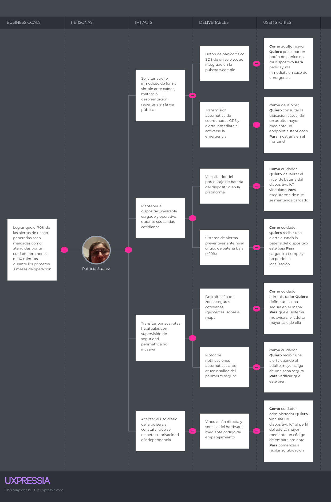
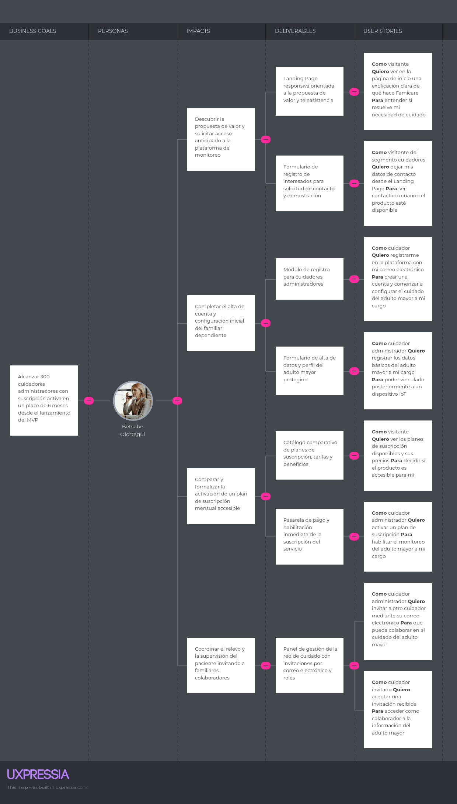

# Capitulo III: Requirements Specification

## 3.1 User Stories

Se utilizan los roles Cuidador (administrador), Cuidador (colaborador), Adulto mayor, Visitante (para el Landing Page) y Developer (para las Technical Stories del RESTful API), siguiendo el Ubiquitous Language definido en la sección 2.5.

### Epics

| Epic ID | Título                               | Descripción                                                                                                                       |
| ------- | ------------------------------------ | --------------------------------------------------------------------------------------------------------------------------------- |
| EP-01 | Care Network & Account Management | Como cuidador, deseo administrar mi cuenta y la red de cuidado del adulto mayor, para coordinar responsabilidades con otros cuidadores.  |
| EP-02 | IoT Device Management | Como cuidador, deseo vincular y monitorear el estado del dispositivo IoT, para asegurar que el adulto mayor cuenta con localización activa. |
| EP-03 | Safe Zones & Risk Alerts | Como cuidador, deseo definir zonas seguras y recibir alertas de riesgo, para reaccionar rápidamente ante una situación de peligro. |
| EP-04 | Location & Activity Monitoring | Como cuidador, deseo visualizar la ubicación y actividad del adulto mayor, para monitorear su bienestar día a día. |
| EP-05 | Subscription & Billing | Como cuidador administrador, deseo gestionar mi suscripción, para mantener el acceso activo a las funcionalidades de la plataforma. |
| EP-06 | Landing Page (Sitio Web Estático) | Como visitante, deseo conocer la propuesta de valor de Famicare, para decidir si me registro. |
| EP-07 | RESTful API — Technical Stories | Como developer, deseo contar con endpoints documentados y consistentes, para integrar el frontend y los dispositivos IoT con el backend. |

### User Stories
  
| Story ID | Título | Descripción | Criterios de Aceptación | Epic ID |
| -------- | ------ | ----------- | ----------------------- | ------- |
| US-01    | Registro de cuidador administrador  | Como cuidador, deseo registrarme en la plataforma con mi correo electrónico, para crear una cuenta y comenzar a configurar el cuidado del adulto mayor a mi cargo. | Given que el cuidador no tiene una cuenta registrada, When ingresa un correo electrónico válido, una contraseña y confirma sus datos, Then el sistema crea la cuenta y la registra con el rol de cuidador administrador.  Given que el cuidador ingresa un correo electrónico ya registrado, When intenta completar el registro, Then el sistema muestra un mensaje indicando que el correo ya está en uso. | EP-01   |
| US-02    | Inicio de sesión  | Como cuidador, deseo iniciar sesión con mi correo y contraseña, para acceder a la información del adulto mayor a mi cargo. | Given que el cuidador tiene una cuenta registrada, When ingresa credenciales válidas, Then el sistema le da acceso a su panel principal.  Given que el cuidador ingresa credenciales incorrectas, When intenta iniciar sesión, Then el sistema muestra un mensaje de error sin especificar cuál dato es incorrecto. | EP-01  |
| US-03    | Agregar adulto mayor al perfil | Como cuidador administrador, deseo registrar los datos básicos del adulto mayor a mi cargo, para poder vincularlo posteriormente a un dispositivo IoT. | Given que el cuidador administrador ha iniciado sesión, When ingresa el nombre, edad y una foto del adulto mayor, Then el sistema crea el perfil del adulto mayor asociado a su cuenta. | EP-01   |
| US-04    | Invitar cuidador a la red de cuidado | Como cuidador administrador, deseo invitar a otro cuidador mediante su correo electrónico, para que pueda colaborar en el cuidado del adulto mayor.  | Given que el cuidador administrador está en el perfil del adulto mayor, When ingresa el correo electrónico de otro cuidador y confirma la invitación, Then el sistema envía una invitación y la registra en estado "pendiente". | EP-01   |
| US-05    | Aceptar invitación a la red de cuidado | Como cuidador invitado, deseo aceptar una invitación recibida, para acceder como colaborador a la información del adulto mayor.  | Given que el cuidador tiene una invitación pendiente, When acepta la invitación desde su cuenta, Then el sistema le otorga acceso de colaborador a la información del adulto mayor correspondiente. | EP-01   |
| US-06    | Revocar acceso de un colaborador | Como cuidador administrador, deseo revocar el acceso de un cuidador colaborador, para mantener actualizada la red de cuidado. | Given que el cuidador administrador visualiza la lista de colaboradores del adulto mayor, When selecciona a un colaborador y confirma la revocación de acceso, Then el sistema elimina el acceso de dicho colaborador a la información del adulto mayor. | EP-01   |
| US-07    | Vincular dispositivo IoT | Como cuidador administrador, deseo vincular un dispositivo IoT al perfil del adulto mayor mediante un código de emparejamiento, para comenzar a recibir su ubicación. | Given que el cuidador administrador tiene el código de emparejamiento del dispositivo, When lo ingresa en el perfil del adulto mayor, Then el sistema vincula el dispositivo y comienza a recibir su ubicación. | EP-02   |
| US-08    | Visualizar nivel de batería | Como cuidador, deseo visualizar el nivel de batería del dispositivo IoT vinculado, para asegurarme de que se mantenga cargado. | Given que el dispositivo está vinculado y en línea, When el cuidador ingresa al perfil del adulto mayor, Then el sistema muestra el porcentaje actual de batería del dispositivo. | EP-02   |
| US-09    | Alerta de batería baja | Como cuidador, deseo recibir una alerta cuando la batería del dispositivo esté baja, para cargarlo a tiempo y no perder la localización.  | Given que el nivel de batería del dispositivo cae por debajo del 20%, When el sistema detecta este umbral, Then genera una alerta de batería baja y la envía a todos los cuidadores de la red de cuidado. | EP-02   |
| US-10    | Definir zona segura | Como cuidador administrador, deseo definir una zona segura en el mapa (por ejemplo, alrededor de la vivienda), para que el sistema me avise si el adulto mayor sale de ella. | Given que el cuidador administrador está en el mapa del adulto mayor, When dibuja un área y le asigna un nombre, Then el sistema guarda la zona segura asociada al adulto mayor. | EP-03   |
| US-11    | Editar zona segura | Como cuidador administrador, deseo editar el área o el nombre de una zona segura existente, para mantenerla actualizada según los cambios de rutina del adulto mayor. | Given que existe una zona segura previamente creada, When el cuidador administrador modifica su área o nombre y guarda los cambios, Then el sistema actualiza la zona segura con la nueva configuración. | EP-03   |
| US-12    | Alerta de salida de zona segura | Como cuidador, deseo recibir una alerta cuando el adulto mayor salga de una zona segura, para verificar que esté bien.  | Given que el adulto mayor se encuentra dentro de una zona segura, When su ubicación registrada queda fuera del área definida, Then el sistema genera una alerta de salida de zona segura y la envía a los cuidadores de la red de cuidado. | EP-03   |
| US-13    | Botón de pánico | Como adulto mayor, deseo presionar un botón de pánico en mi dispositivo, para pedir ayuda inmediata en caso de emergencia. | Given que el dispositivo IoT está vinculado y en línea, When el adulto mayor presiona el botón de pánico, Then el sistema genera una alerta de emergencia con la ubicación actual y la envía de inmediato a todos los cuidadores de la red de cuidado. | EP-03   |
| US-14    | Alerta de inactividad prolongada | Como cuidador, deseo recibir una alerta cuando el adulto mayor no registre movimiento durante un periodo prolongado, para verificar que no haya ocurrido un incidente. | Given que el dispositivo no registra cambios de ubicación ni movimiento durante más del tiempo configurado como umbral, When se cumple dicho umbral, Then el sistema genera una alerta de inactividad y la envía a los cuidadores de la red de cuidado. | EP-03   |
| US- 16 | Ubicación en tiempo real | Como cuidador, deseo ver en un mapa la ubicación actual del adulto mayor, para saber dónde se encuentra en todo momento. | Given que el dispositivo IoT está vinculado y en línea, When el cuidador ingresa al perfil del adulto mayor, Then el sistema muestra su ubicación actual sobre un mapa. | EP-04 |
| US-17 | Historial de ubicación | Como cuidador, deseo consultar el historial de ubicaciones del adulto mayor en un rango de fechas, para revisar sus desplazamientos pasados. | Given que el cuidador selecciona un rango de fechas dentro del historial disponible, When solicita ver el historial de ubicación, Then el sistema muestra el recorrido registrado del adulto mayor durante ese periodo. | EP-04  |
| US-18 | Reporte de actividad | Como cuidador, deseo recibir un reporte periódico de la actividad del adulto mayor, para identificar patrones inusuales a lo largo del tiempo. | Given que ha transcurrido el periodo configurado para el reporte (por ejemplo, semanal), When el sistema genera el reporte correspondiente, Then lo pone a disposición de los cuidadores de la red de cuidado. | EP-04 |
| US-19 | Activar suscripción | Como cuidador administrador, deseo activar un plan de suscripción, para habilitar el monitoreo del adulto mayor a mi cargo. | Given que el cuidador administrador ha seleccionado un plan de suscripción, When completa el proceso de pago exitosamente, Then el sistema activa la suscripción y habilita las funcionalidades correspondientes. | EP-05 |
| US-20 | Renovar suscripción | Como cuidador administrador, deseo que mi suscripción se renueve automáticamente, para no perder el acceso a la plataforma por descuido. | Given que la suscripción está activa y configurada con renovación automática, When se alcanza la fecha de vencimiento, Then el sistema procesa la renovación y extiende la vigencia de la suscripción. | EP-05
| US-21 | Cancelar suscripción | Como cuidador administrador, deseo cancelar mi suscripción cuando lo decida, para dejar de ser facturado. | Given que el cuidador administrador tiene una suscripción activa, When solicita la cancelación y la confirma, Then el sistema marca la suscripción como cancelada y suspende la renovación automática. | EP-05 |
| US-22 | Conocer la propuesta de valor | Como visitante, deseo ver en la página de inicio una explicación clara de qué hace Famicare, para entender si resuelve mi necesidad de cuidado. | Given que el visitante ingresa al Landing Page, When la página carga completamente, Then el visitante ve una sección principal (hero) con el nombre del producto, una descripción breve de su propuesta de valor y un call-to-action visible. | EP-06  |
| US-23 | Solicitar acceso / demo desde el Landing Page | Como visitante del segmento cuidadores, deseo dejar mis datos de contacto desde el Landing Page, para ser contactado cuando el producto esté disponible. | Given que el visitante completa el formulario de contacto con nombre y correo electrónico válidos, When envía el formulario, Then el sistema confirma visualmente el registro y redirige al visitante a la vista de registro correspondiente en la Web Application. | EP-06  |
| US24 | Consultar planes y precios | Como visitante, deseo ver los planes de suscripción disponibles y sus precios, para decidir si el producto es accesible para mí. | Given que el visitante navega a la sección de planes del Landing Page, When la sección carga, Then el visitante ve al menos un plan con su nombre, precio y principales beneficios incluidos. | EP-06 |
| US25 | Consultar términos y condiciones | Como visitante, deseo acceder a los términos y condiciones de servicio desde el footer, para conocer mis derechos y responsabilidades antes de registrarme. | Given que el visitante se encuentra en cualquier página del Landing Page o la Web Application, When hace clic en el enlace "Términos y condiciones" del footer, Then el sistema muestra el documento correspondiente. | EP-06 |
| TS01 | Autenticación vía API | Como developer, deseo autenticarme mediante un endpoint de login, para obtener un token de acceso válido para las siguientes peticiones. | Given que el developer envía una petición POST a /api/auth/login con credenciales válidas, When el servidor las valida correctamente, Then responde con un código 200 y un token de acceso.  Given que el developer envía credenciales inválidas, When el servidor las valida, Then responde con un código 401 y un mensaje de error. | EP-07 |
| TS02 | Consultar ubicación actual vía API | Como developer, deseo consultar la ubicación actual de un adulto mayor mediante un endpoint autenticado, para mostrarla en el frontend. | Given que el developer envía una petición GET a /api/elderly/{id}/location con un token válido y permisos sobre ese adulto mayor, When el servidor procesa la solicitud, Then responde con un código 200 y las coordenadas más recientes registradas.  Given que el developer no tiene permisos sobre ese adulto mayor, When realiza la misma petición, Then el servidor responde con un código 403. | EP-07 |
| TS03 | Registrar zona segura vía API | Como developer, deseo registrar una zona segura mediante un endpoint autenticado, para que la Web Application pueda persistir la configuración hecha por el cuidador. | Given que el developer envía una petición POST a /api/elderly/{id}/safe-zones con un token válido y un cuerpo con las coordenadas y el nombre de la zona, When el servidor valida los datos, Then responde con un código 201 y el recurso creado. | EP-07 |
| TS04 | Suscripción a notificaciones de alerta | Como developer, deseo registrar un endpoint de callback (webhook) para recibir alertas en tiempo real, para poder mostrar notificaciones push en el frontend sin necesidad de consultar constantemente el API. | Given que el developer envía una petición POST a /api/webhooks con una URL de callback válida, When se genera una nueva alerta de riesgo para un adulto mayor asociado, Then el sistema envía un POST a la URL registrada con los datos de la alerta. | EP-07 |

## 3.2 Impact Mapping

El Impact Map conecta los Business Goals con los Actors/Personas que pueden ayudar a lograrlos, el Impact (cambio de comportamiento esperado en ellos) y los Deliverables (lo que el equipo construye para lograr ese impacto), de los cuales se derivan las User Stories.

Segmento 1 - Adultos Mayores:

Segmento 2 - Cuidadores:

## 3.3 Product Backlog

El orden del backlog se definió priorizando: (1) valor de negocio visible desde el primer sprint (Landing Page y flujo básico de onboarding), (2) el núcleo funcional de seguridad (zonas seguras y alertas, que es la propuesta de valor central de Famicare), y (3) funcionalidades de monitoreo histórico y suscripción, que aportan valor sostenido pero no son críticas para un primer demo funcional.

La estimación técnica de cada historia se expresa mediante **Story Points**.

| Orden | User Story ID | Título | Descripción | Story Points |
| :---: | :---: | :--- | :--- | :---: |
| 1 | US-22 | Conocer la propuesta de valor | Como visitante, deseo ver la propuesta de valor de Famicare en el Landing Page. | 2 |
| 2 | US-25 | Consultar términos y condiciones | Como visitante, deseo acceder a los términos y condiciones desde el footer. | 1 |
| 3 | US-01 | Registro de cuidador administrador | Como cuidador, deseo registrarme en la plataforma. | 3 |
| 4 | US-02 | Inicio de sesión | Como cuidador, deseo iniciar sesión con mi correo y contraseña. | 2 |
| 5 | US-23 | Solicitar acceso / demo desde el Landing Page | Como visitante, deseo dejar mis datos de contacto y ser redirigido al registro. | 2 |
| 6 | US-03 | Agregar adulto mayor al perfil | Como cuidador administrador, deseo registrar los datos del adulto mayor a mi cargo. | 3 |
| 7 | US-07 | Vincular dispositivo IoT | Como cuidador administrador, deseo vincular un dispositivo IoT al adulto mayor. | 5 |
| 8 | US-16 | Ubicación en tiempo real | Como cuidador, deseo ver la ubicación actual del adulto mayor en un mapa. | 5 |
| 9 | US-10 | Definir zona segura | Como cuidador administrador, deseo definir una zona segura en el mapa. | 5 |
| 10 | US-12 | Alerta de salida de zona segura | Como cuidador, deseo recibir una alerta cuando el adulto mayor salga de la zona segura. | 8 |
| 11 | US-13 | Botón de pánico | Como adulto mayor, deseo presionar un botón de pánico para pedir ayuda. | 8 |
| 12 | US-04 | Invitar cuidador a la red de cuidado | Como cuidador administrador, deseo invitar a otro cuidador a colaborar. | 3 |
| 13 | US-05 | Aceptar invitación a la red de cuidado | Como cuidador invitado, deseo aceptar la invitación recibida. | 2 |
| 14 | US-15 | Marcar alerta como atendida | Como cuidador, deseo marcar una alerta como atendida. | 2 |
| 15 | US-11 | Editar zona segura | Como cuidador administrador, deseo editar una zona segura existente. | 2 |
| 16 | US-08 | Visualizar nivel de batería | Como cuidador, deseo ver el nivel de batería del dispositivo. | 2 |
| 17 | US-09 | Alerta de batería baja | Como cuidador, deseo recibir una alerta cuando la batería esté baja. | 3 |
| 18 | US-14 | Alerta de inactividad prolongada | Como cuidador, deseo recibir una alerta si el adulto mayor no registra movimiento por mucho tiempo. | 5 |
| 19 | US-24 | Consultar planes y precios | Como visitante, deseo ver los planes de suscripción disponibles. | 2 |
| 20 | US-19 | Activar suscripción | Como cuidador administrador, deseo activar un plan de suscripción. | 5 |
| 21 | US-17 | Historial de ubicación | Como cuidador, deseo consultar el historial de ubicación del adulto mayor. | 3 |
| 22 | US-18 | Reporte de actividad | Como cuidador, deseo recibir un reporte periódico de actividad. | 5 |
| 23 | US-06 | Revocar acceso de un colaborador | Como cuidador administrador, deseo revocar el acceso de un colaborador. | 2 |
| 24 | US-20 | Renovar suscripción | Como cuidador administrador, deseo que mi suscripción se renueve automáticamente. | 3 |
| 25 | US-21 | Cancelar suscripción | Como cuidador administrador, deseo cancelar mi suscripción. | 2 |
| 26 | TS-01 | Autenticación vía API | Como developer, deseo autenticarme mediante un endpoint de login. | 3 |
| 27 | TS-02 | Consultar ubicación actual vía API | Como developer, deseo consultar la ubicación actual vía API. | 3 |
| 28 | TS-03 | Registrar zona segura vía API | Como developer, deseo registrar una zona segura vía API. | 3 |
| 29 | TS-04 | Suscripción a notificaciones de alerta | Como developer, deseo registrar un webhook para recibir alertas en tiempo real. | 5 |
