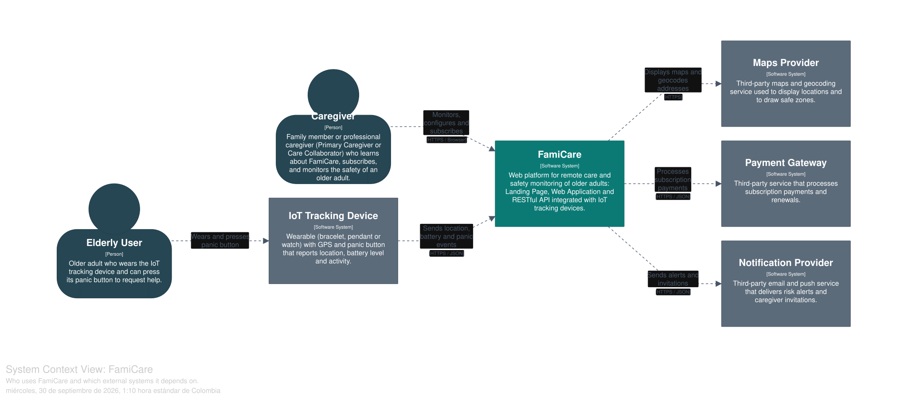
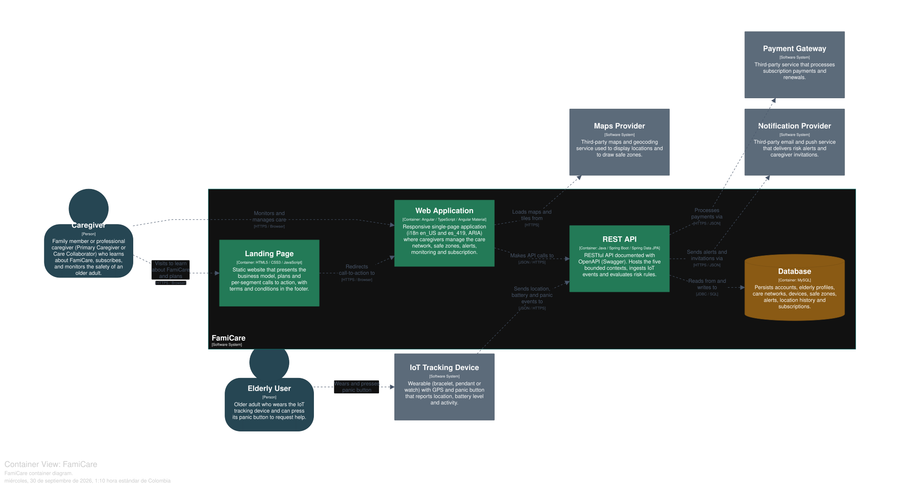
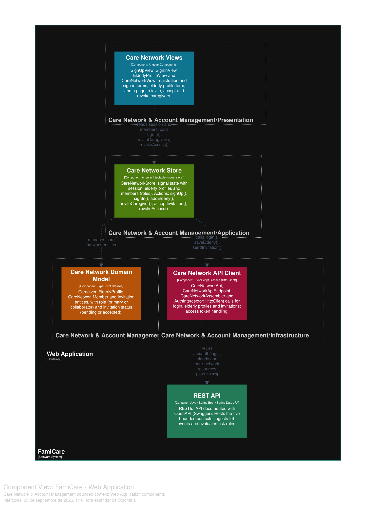
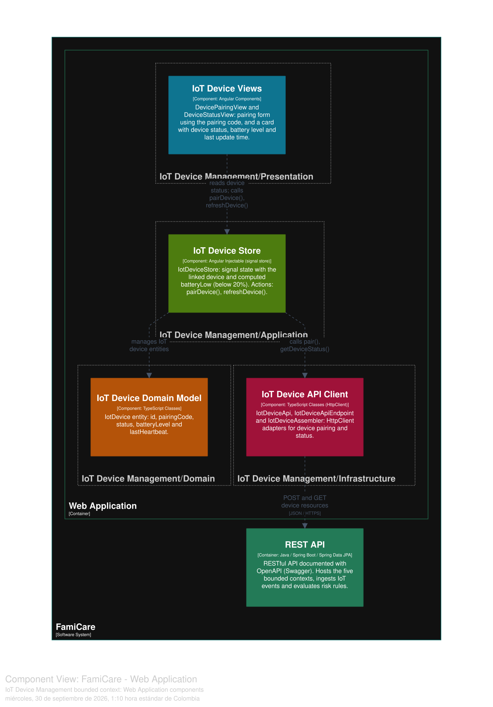
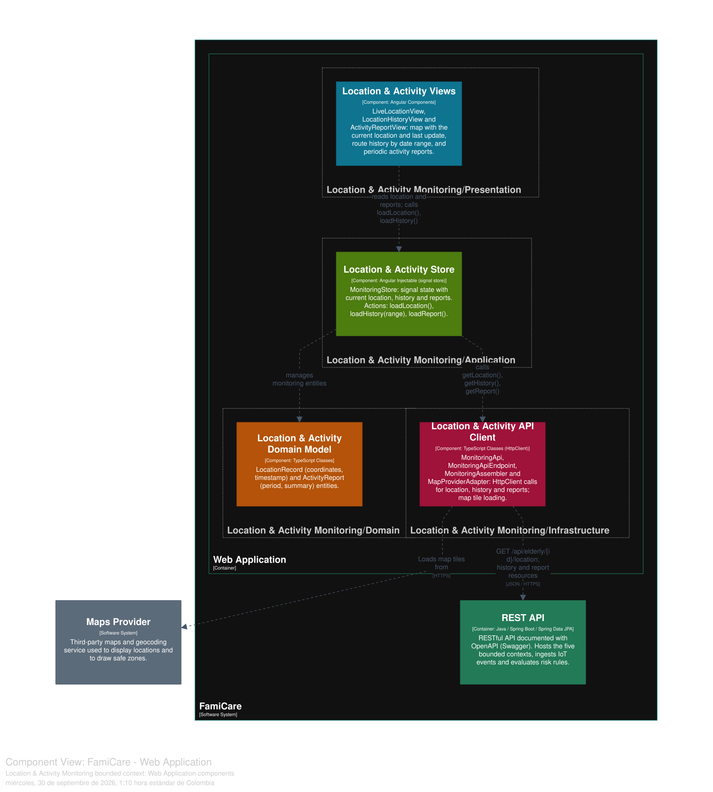
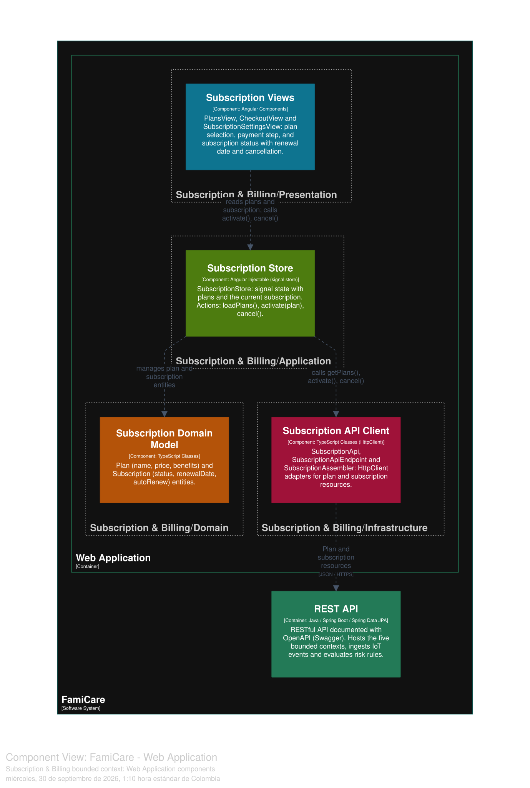
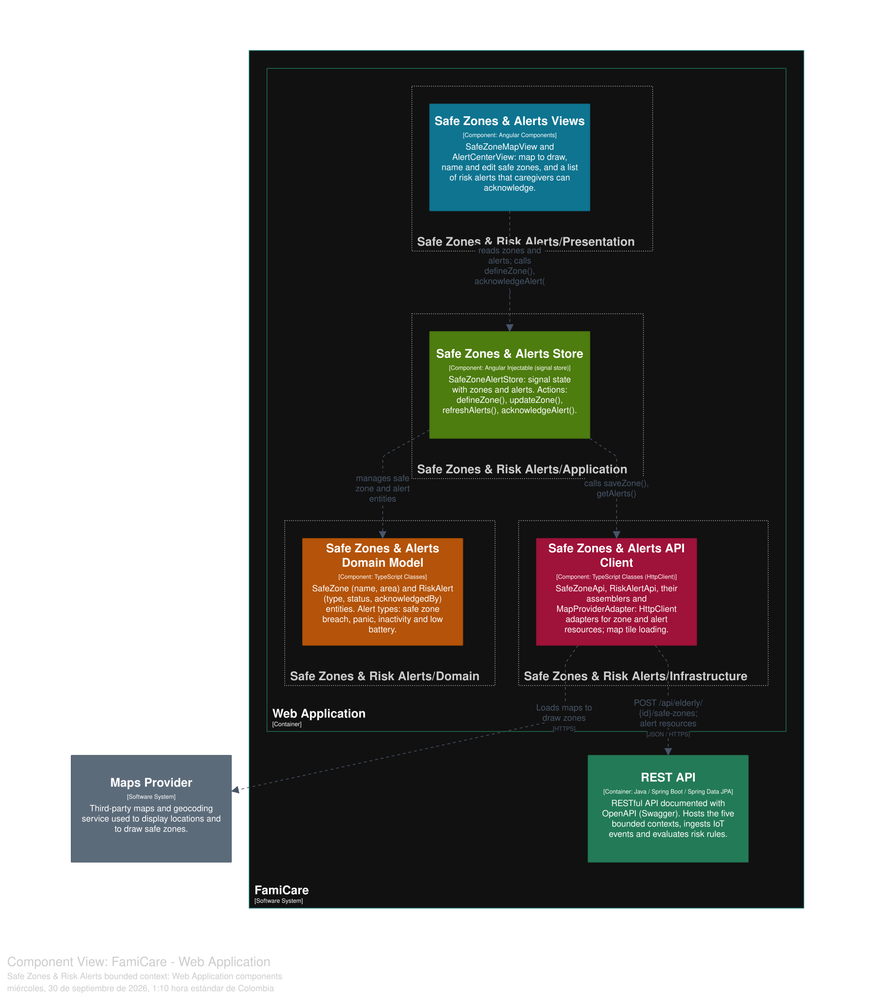
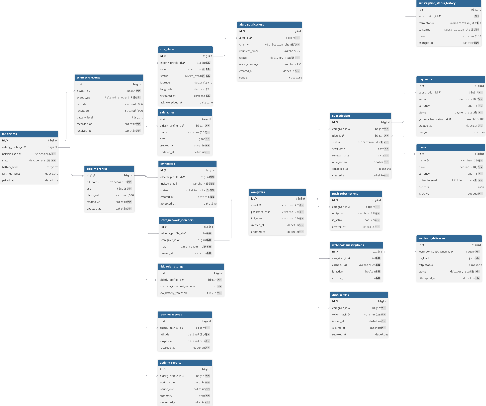

# Capítulo IV: Product Design

El diseño de producto de FamiCare integra la arquitectura de software guiada por el dominio (Domain-Driven Design), el diseño orientado a objetos y una experiencia de usuario (UX/UI) web responsive centrada en la accesibilidad para cuidadores y adultos mayores. Esta propuesta traduce los requerimientos funcionales y las historias de usuario del Capítulo III en interfaces intuitivas y servicios desacoplados bajo estándares de la industria.

## 4.1. Style Guidelines

Para asegurar coherencia visual y usabilidad entre la Landing Page y la Web Application, se definió un sistema de diseño cimentado en **Material Design 3**, implementado a través de **Angular Material** (`material-theme.scss`).

### 4.1.1. General Style Guidelines

* **Branding:** La identidad de *Serenia* y su producto *FamiCare* transmite tranquilidad, protección médica, empatía y confiabilidad tecnológica. Se proyecta cercanía familiar sin perder el rigor de una solución de teleasistencia y monitoreo en tiempo real.
* **Tono de Comunicación:**
  * *Dimensión Serio / Divertido:* Formal y sereno (orientado a salud, seguridad y prevención de incidentes críticos).
  * *Dimensión Formal / Casual:* Respetuoso y cercano (lenguaje empático, comprensible tanto para familias como para cuidadores de la salud).
  * *Dimensión Respetuoso / Irreverente:* Altamente respetuoso de la dignidad, autonomía y privacidad del adulto mayor.
  * *Dimensión Entusiasta / Sereno:* Sereno y reflexivo (evita alarmismos innecesarios; las alertas son claras y directas para propiciar calma y acción rápida).
* **Typography:**
  * Familia tipográfica principal: `Roboto` / `Inter`, optimizadas para pantallas digitales y alta legibilidad.
  * Jerarquías de texto:
    * *Display / H1 (32px - 40px, Bold):* Títulos de secciones en el Landing Page (`hero-section`, títulos principales).
    * *Headline / H2 (24px - 28px, Semi-Bold):* Nombres de módulos, encabezados de tarjetas (`features-section`, `plan-selection`).
    * *Title / H3 (20px, Medium):* Subtítulos y modales de confirmación de eventos/alertas.
    * *Body 1 (16px, Regular, interlineado 1.5):* Textos informativos, descripciones de planes y formularios de registro.
    * *Body 2 / Caption (12px - 14px, Regular):* Metadatos, etiquetas secundarias, indicadores de batería y textos de pie de página (`footer-section`).
* **Colors (Paleta Angular Material):**
  * *Primary (Azul Cuidado / Serenity Blue - `#1976D2` / `#0D47A1`):* Color primario que evoca estabilidad, salud, calma y confianza tecnológica.
  * *Secondary / Accent (Verde Esperanza / Health Teal - `#00897B` / `#2E7D32`):* Utilizado para estados seguros, dispositivos en línea, botones de confirmación y llamadas a la acción (CTA) secundarias.
  * *Warn / Emergency (Rojo SOS / Alert Coral - `#D32F2F`):* Reservado exclusivamente para alertas críticas: activación del botón de pánico, salida de zonas seguras y advertencias de batería baja.
  * *Warning (Ámbar - `#FFA000`):* Alertas de inactividad prolongada o estados intermedios.
  * *Neutral Backgrounds (`#F8F9FA`, `#FFFFFF`):* Superficies limpias con alto contraste para garantizar la legibilidad en cuidadores y adultos mayores.
  * *Neutral Text (`#212121`, `#5F6368`):* Tonos neutros oscuros conformes con el estándar de contraste WCAG AA.
* **Spacing:**
  * Se emplea un sistema de cuadrícula (*Grid System*) basado en múltiplos de **8px** (8px, 16px, 24px, 32px, 48px, 64px) para márgenes y paddings, garantizando ritmo vertical y alineación armónica en todos los componentes.

### 4.1.2. Web Style Guidelines

* **Breakpoints Responsive:**
  * *Mobile:* `< 600px` (diseño a una sola columna, menús colapsables tipo hamburguesa, botones táctiles con área mínima de interacción de 48x48px).
  * *Tablet:* `600px - 1024px` (cuadrículas de 2 columnas para planes y características).
  * *Desktop:* `> 1024px` (maquetación fluida a ancho completo, visualización de mapas interactivos a pantalla dividida con panel lateral de control).
* **Componentes de Interfaz (Angular Material):**
  * *Botones (`MatButton`):* Botones elevados (*raised*) para CTA principales ("Comenzar ahora", "Registrarse"), botones de texto plano para navegación secundaria.
  * *Tarjetas (`MatCard`):* Contenedores con ligera elevación para presentar los planes (`plan-selection`), testimonios, características y perfiles de adultos mayores.
  * *Formularios (`MatFormField`, `MatInput`):* Campos de texto con validación flotante, mensajes de error explícitos y soporte para lectura por teclado (`register`, `contact-section`).
  * *Diálogos y Notificaciones (`MatDialog`, `MatSnackBar`):* Mensajes flotantes temporales para confirmar acciones (ej. "Invitación enviada", "Alerta atendida").

## 4.2. Information Architecture

### 4.2.1. Organization Systems

* **Organización Jerárquica:** Estructura en árbol utilizada en la Web Application donde el cuidador accede desde una visión general (Dashboard principal) hacia el perfil de un adulto mayor específico, y de allí a sus subsecciones (Zonas Seguras, Historial de Ubicaciones, Configuración de IoT y Red de Cuidado).
* **Organización Secuencial:** Flujo guiado paso a paso para procesos de Onboarding: *Selección de Plan (`plan-selection`) → Registro de Cuenta (`register`) → Pasarela de Pago (`payment-success` / `payment-cancel`) → Vinculación del Dispositivo IoT*.
* **Organización por Tópicos y Audiencia:** Aplicada en la Landing Page, segmentando la información según el rol del visitante (cuidadores familiares vs. cuidadores formales) en secciones como `client-features-section` y `highlights-section`.

### 4.2.2. Labeling Systems

Se seleccionaron etiquetas directas, familiares y desprovistas de jerga técnica compleja:

| Sección / Componente | Etiqueta en Interfaz | Significado / Destino |
| :--- | :--- | :--- |
| `layout` / Navbar | **Inicio** | Retorno al encabezado principal (`hero-section`). |
| `layout` / Navbar | **Características** | Desplazamiento a funciones del sistema (`features-section`). |
| `layout` / Navbar | **Cómo Funciona** | Explicación del funcionamiento con IoT (`how-it-works-section`). |
| `layout` / Navbar | **Planes** | Catálogo de precios y suscripciones (`plan-selection`). |
| `layout` / Navbar | **Equipo** | Perfil de los desarrolladores y la startup (`about-team-section`). |
| `layout` / Navbar | **Contacto** | Formulario de dudas y solicitud de demo (`contact-section`). |
| `layout` / Navbar | **Acceder** | Acceso a la Web Application para usuarios existentes. |
| `language-switcher` | **ES / EN** | Alternancia dinámica de idioma en la interfaz. |
| `footer-section` | **Términos y Condiciones** | Información legal, privacidad de datos de salud y localización. |
| Web App | **Zonas Seguras** | Configuración de geocercas activas. |
| Web App | **Red de Cuidado** | Miembros colaboradores autorizados para supervisar. |

### 4.2.3. SEO Tags and Meta Tags

| Sitio | Página | Title | Meta Description | Meta Keywords | Meta Author |
| :--- | :--- | :--- | :--- | :--- | :--- |
| Landing Page | Inicio (`/`) | FamiCare - Cuidado y Seguridad Inteligente para Adultos Mayores | Plataforma web de telemonitoreo en tiempo real, geocercas y alertas IoT para el cuidado integral de adultos mayores en el Perú. | cuidado adulto mayor, GPS adultos mayores Lima, telemonitoreo, geocercas, serenia famicare, botón de pánico | Serenia Team |
| Landing Page | Planes (`/plans`) | Planes y Suscripciones - FamiCare | Conoce nuestros planes accesibles de telecuidado para familias y cuidadores profesionales. Tranquilidad garantizada. | precios famicare, suscripción cuidado adultos mayores, planes monitoreo IoT | Serenia Team |
| Landing Page | Contacto (`/contact`) | Contáctanos - Serenia FamiCare | Solicita una demostración o comunícate con nuestro equipo para integrar FamiCare en tu hogar o residencia. | contacto famicare, demo teleasistencia, soporte serenia | Serenia Team |
| Web Application | Registro (`/register`) | Registro de Cuidador - FamiCare | Crea tu cuenta como cuidador administrador y empieza a proteger a tus seres queridos con FamiCare. | crear cuenta cuidador, registro famicare, signup | Serenia Team |
| Web Application | Dashboard (`/dashboard`) | Panel de Monitoreo - FamiCare | Visualiza en tiempo real la ubicación, alertas y estado de los adultos mayores a tu cargo. | panel de control famicare, mapa en tiempo real, alertas de riesgo | Serenia Team |

### 4.2.4. Searching Systems

* **Búsqueda y Selección de Adultos Mayores:** Menú selector directo con barra de filtrado por nombre para cuidadores formales que administran múltiples adultos mayores.
* **Filtros de Alertas e Incidentes:** Filtrado por criticidad (Crítica/SOS, Moderada/Zona Segura, Informativa/Batería) y por estado de resolución (Atendida / No Atendida).
* **Filtros de Historial de Desplazamiento:** Selector de rango de fechas y horas para consultar el recorrido histórico sobre el mapa interactivo.

### 4.2.5. Navigation Systems

* **Navegación Global:** Barra de navegación fija (*Navbar*) persistente en el encabezado con acceso directo a las secciones del Landing Page, switch de idioma bilingüe (`language-switcher`) y botón principal CTA ("Comenzar Ahora").
* **Navegación Local / Contextual:** Barra lateral (*Sidebar*) colapsable dentro de la Web Application que organiza el acceso por Bounded Contexts: Mapa en Vivo, Geocercas, Alertas, Red de Cuidado y Facturación.
* **Navegación Suplementaria:** Pie de página (`footer-section`) que recopila enlaces legales, código abierto (`opensource-section`), canales de soporte y redes sociales.

## 4.3. Landing Page UI Design

La interfaz del Landing Page traduce la propuesta de valor de Serenia en una experiencia web accesible y persuasiva. Construida mediante componentes modulares en Angular, guía al visitante desde el descubrimiento del problema hasta la conversión.

### 4.3.1. Landing Page Wireframe

Los wireframes de baja y media fidelidad fueron desarrollados en **Figma** tanto para resoluciones Desktop (1440px) como Mobile (375px). Se priorizó una distribución jerárquica limpia:
* Un área de impacto superior (*Hero*) con propuesta de valor directa y CTA claro.
* Bloques informativos diferenciados (`features-section` y `client-features-section`) para ilustrar la tecnología IoT y la app web.
* Diagrama ilustrativo paso a paso en `how-it-works-section`.
* Sección de transparencia institucional con `about-team-section` y `opensource-section`.

### 4.3.2. Landing Page Mock-up

Los mock-ups de alta fidelidad implementan la guía de estilos con componentes de Angular Material, contrastes conformes a WCAG AA y fotografía empática centrada en familias reales peruanas. Reflejan con precisión visual cada componente implementado en el repositorio:
* **Hero Banner:** Titular convincente, ilustración de la pulsera IoT y llamada a la acción hacia el registro.
* **Catálogo de Planes (`plan-selection`):** Comparador de características entre el plan básico freemium y el plan premium multi-cuidador.
* **Sección de Contacto (`contact-section`):** Formulario directo para resolver dudas o solicitar pilotos institucionales.

## 4.4. Web Applications UX/UI Design

### 4.4.1. Web Applications Wireframes
Estructuran la disposición funcional del panel del cuidador, priorizando el mapa de ubicación en el área central y relegando los controles secundarios a barras de herramientas limpias.

### 4.4.2. Web Applications Wireflow Diagrams
Diagraman el recorrido de pantallas con estados condicionales para las metas críticas: (1) Vinculación de un wearable IoT vía código, (2) Trazado y guardado de una zona segura poligonal, y (3) Recepción y marcado de atención de una alerta de emergencia SOS.

### 4.4.3. Web Applications Mock-ups
Mock-ups de alta fidelidad que ilustran el estado interactivo del dashboard: pines de geolocalización en tiempo real, delimitadores circulares/poligonales de geofencing en color verde, y banners emergentes de alerta crítica en rojo oscuro con botón de acción inmediata.

### 4.4.4. Web Applications User Flow Diagrams
Definen el camino ideal (*Happy Path*) y las rutas alternativas de excepción (*Unhappy Paths*):
* *Flujo de Registro y Suscripción:* Registro exitoso vs. correo duplicado o tarjeta rechazada en la pasarela.
* *Flujo de Configuración de Geocerca:* Trazado correcto vs. zona con radio insuficiente.
* *Flujo de Atención de Alerta SOS:* Notificación push inmediata → apertura de ubicación → confirmación de llamada/atención.

## 4.5. Web Applications Prototyping

El prototipo interactivo de alta fidelidad fue desarrollado en **Figma**, simulando las transiciones de la Web Application y el flujo de navegación entre la Landing Page y el módulo de registro/pago.
* **Enlace al video de navegación:** [*Ver en Microsoft Stream*](https://upcedupe-my.sharepoint.com/)  
* **Archivo de referencia:** `upc-pre-202620-1asi0729-7729-serenia-prototype-navigation-sprint-2.mp4`

## 4.6. Domain-Driven Software Architecture

### 4.6.1. Design-Level Event Storming
A partir del análisis de eventos del negocio, se delimitaron 5 Bounded Contexts centrales reflejados en la arquitectura:
1. **Care Bounded Context:** Administra perfiles de adultos mayores, cuentas de cuidadores (administradores y colaboradores) y el grafo de relaciones de la red de cuidado.
2. **IoT Bounded Context:** Gestiona el ciclo de vida de los dispositivos (wearables), estado de vinculación, conectividad y telemetría de batería.
3. **Monitor Bounded Context:** Captura coordenadas GPS en tiempo real, detecta eventos de inactividad o caídas, y despacha alertas ante el accionamiento del botón de pánico.
4. **Zones Bounded Context:** Modela las geocercas o zonas seguras y evalúa de manera continua si la última coordenada conocida cruza los límites definidos.
5. **Subs Bounded Context:** Gestiona la contratación de planes de suscripción, facturación recurrente y pasarelas de pago.

### 4.6.2. Software Architecture Context Diagram

### 4.6.3. Software Architecture Container Diagrams

### 4.6.4. Software Architecture Components Diagrams

#### Care Bounded Context
##### Frontend:

#### IOT Bounded Context

##### Frontend:

#### Monitor Bounded Context
##### Frontend:

#### Subs Bounded Context
##### Frontend:

#### Zones Bounded Context
##### Frontend:

## 4.7. Software Object-Oriented Design

### 4.7.1. Class Diagrams
El diseño orientado a objetos del backend (Java con Spring Boot y arquitectura limpia) estructura las entidades y agregados por cada Bounded Context:
* **Care Context:** Clases `Caregiver` (id, name, email, role), `Elderly` (id, fullName, age, emergencyContacts) y `CareNetworkInvitation` (token, status, invitedAt).
* **IoT Context:** Entidad `Device` (deviceId, serialNumber, pairingCode, batteryLevel, isOnline).
* **Monitor Context:** Agregado `TrackingRecord` (id, deviceId, latitude, longitude, timestamp) y entidad `RiskAlert` (alertId, alertType, severity, status, createdAt, resolvedAt).
* **Zones Context:** Agregado `SafeZone` (id, elderlyId, name, polygonCoordinates, isActive).
* **Subs Context:** Agregado `Subscription` (id, caregiverId, planType, startDate, endDate, status).

---

## 4.8. Database Design

### 4.8.1. Database Diagrams
El esquema relacional documentado en `diagrama-DB.svg` refleja el almacenamiento normalizado para garantizar la integridad referencial y auditoría de eventos de alerta, geoposiciones e identidades de usuario.

### 4.8.1. Database Diagrams

